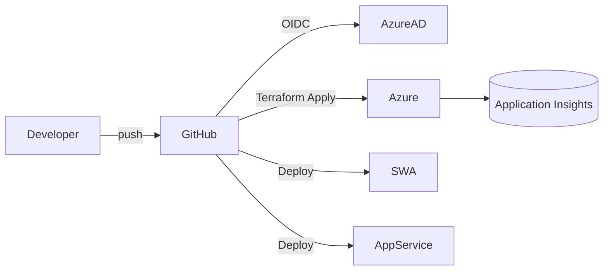
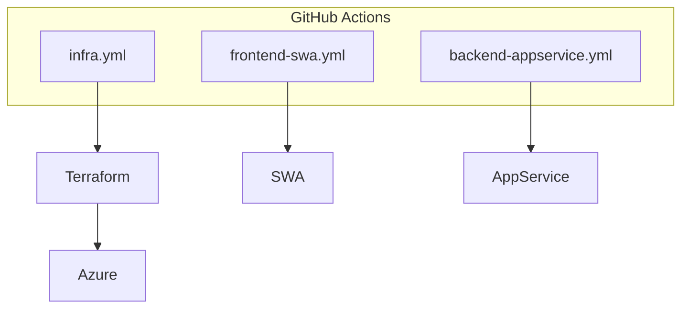
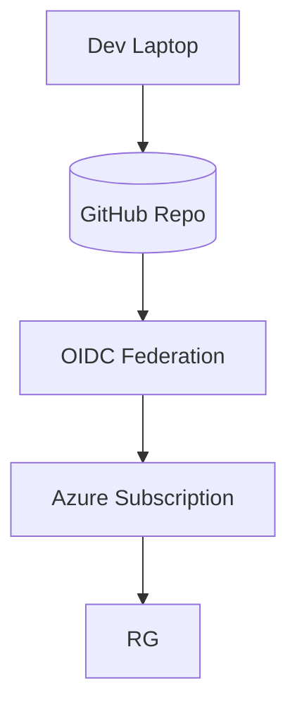

# Arc42 Architektur-Dokumentation – VSME Report

## 1. Einführung und Ziele

### 1.1 Aufgabenstellung
Bereitstellung einer skalierbaren Cloud-Umgebung auf Microsoft Azure für die VSME-Anwendung:

- React-Frontend (Azure Static Web App)
- Java/Spring Boot Backend (Azure App Service, Always On)
- Übergreifendes Monitoring mittels Application Insights
- Infrastruktur als Code (Terraform) und CI/CD (GitHub Actions, OIDC)

### 1.2 Qualitätsziele

| Qualität              | Ausprägung                                                                 |
|-----------------------|----------------------------------------------------------------------------|
| Deploybarkeit         | Vollautomatisierte Pipelines, Zero-Secrets (OIDC)                         |
| Beobachtbarkeit       | Application Insights (Requests, Dependencies, Logs)                       |
| Skalierbarkeit        | App Service Plan (Linux, skalierbar), SWA Standard                        |
| Wartbarkeit           | Strukturierte Terraform-Module & Workflows, klar dokumentiert             |
| Sicherheit            | Least Privilege via Managed Identity & OIDC, HTTPS-only                   |

### 1.3 Stakeholder

| Rolle            | Interesse                                                             |
|------------------|-----------------------------------------------------------------------|
| Produktteam      | Schnelles Feedback, automatische Deployments                          |
| DevOps/Cloud     | Nachvollziehbare Infrastruktur, Idempotenz, Monitoring                 |
| Security         | Vermeidung langlebiger Secrets, Auditierbarkeit                       |
| Betrieb          | Transparente Logs/Telemetry, Health Checks                            |

## 2. Randbedingungen

- Cloud: Microsoft Azure
- IaC: Terraform ≥ 1.6, Provider azurerm 4.x
- CI/CD: GitHub Actions mit OIDC (azure/login)
- Region primär `westeurope` (variabel)
- Java 17, Node 18 (anpassbar)
- Keine Nutzung von Azure DevOps, Key Vault optional

## 3. Kontextabgrenzung

### 3.1 Fachliche Kontextdiagramm

```mermaid
graph TD
  User[Business User] -->|Browser| SWA[Azure Static Web App]
  SWA -->|REST| API[Azure App Service (Spring Boot)]
  API --> DB[(Persistenz, optional)]
  API --> AI[(Application Insights)]
```

### 3.2 Technischer Kontext



## 4. Lösungsstrategie

- **Infrastructure as Code**: Terraform in `infra/`, Remote State über Azure Storage
- **Deployment Pipelines**: Drei Workflows (Infra, Frontend, Backend) mit Pfadfiltern
- **Monitoring**: Application Insights Connection String + Auto-Instrumentation Einstellungen
- **Security**: HTTPS-only, Always On, FTPS disabled, System Assigned Identity
- **Skalierbarkeit**: App Service Plan (P1v2 standard), SWA Standard SKU

## 5. Bausteinsicht

### 5.1 Infrastruktur-Bausteine

```mermaid
graph TD
  RG[Resource Group]
  RG --> SWA[Static Web App]
  RG --> ASP[App Service Plan (Linux)]
  ASP --> APP[Linux Web App]
  RG --> AI[Application Insights]
  APP --> AI
  RG -->|Optional| Storage[(Storage/DB)]
```

### 5.2 CI/CD Bausteine



## 6. Laufzeitsicht

1. **Frontend Deployment**  
   - Build React  
   - `az staticwebapp upload`  
   - Veröffentlichung via globales SWA CDN

2. **Backend Deployment**  
   - Build Spring Boot JAR  
   - `az webapp deploy --type jar`  
   - Healthcheck via Default Hostname (z. B. `/actuator/health`)

3. **Monitoring Flow**  
   - App Service sendet Telemetrie über AI Agent  
   - Application Insights korreliert Requests & Dependencies  
   - Zugriff via Portal oder `az monitor app-insights`/Log Analytics

## 7. Verteilungssicht



## 8. Querschnittliche Konzepte

- **Konfiguration**: Terraform Variablen (Location, Environment, SKU), GitHub Vars für Deployments
- **Security**: OIDC, Managed Identity, HTTPS-only, FTPS disabled
- **Observability**: Application Insights, Logs (App Service), Healthcheck Step
- **Modularität**: Terraform-Dateien nach Aufgaben getrennt (providers, main, variables, outputs)
- **Idempotenz**: Terraform + GitHub Actions (Plan/Apply nur auf `main`)

## 9. Architekturentscheidungen (ADR Light)

- **Azure Static Web App** statt App Service für Frontend (CDN + Globale Distribution out-of-the-box)
- **Terraform** statt ARM/Bicep (Provider-Ökosystem, Team-Erfahrung)
- **GitHub Actions + OIDC** statt Service Principal Secrets (Secretless Auth)
- **Application Insights Auto-Agent** für Java (schnelle Integration, minimale App-Änderung)

## 10. Risiken & Schulden

| Risiko                         | Gegenmaßnahme                                               |
|--------------------------------|-------------------------------------------------------------|
| Fehlende Produktions-SKU       | Terraform Variablen für SKU, Review vor Prod-GoLive        |
| Terraform Backend nicht konfig | README-Anleitung, `vars` Pflicht                          |
| Telemetrie-Lücken              | Backend Exports Telemetry, Logging-Level prüfen            |
| Healthcheck Path falsch        | GitHub Variable `BACKEND_HEALTHCHECK_PATH` anpassen        |

## 11. Tests & Qualitätssicherung

- Terraform `validate` + `plan` via CI  
- Linting/Formatierung (optional via `terraform fmt`)  
- Healthcheck-Call nach Backend-Deployment  
- Manuelle Prüfungen Application Insights (Verbindungen)

## 12. Betrieb & Wartung

- Skalierung via Terraform (`app_service_sku_name`, SWA SKU)  
- Rotation/Update OIDC Credentials durch Azure AD  
- Backups für App Service (falls notwendig)  
- Log Retention & Alerting in Application Insights/Monitor (noch einzurichten)

## 13. Glossar

| Begriff      | Bedeutung                                           |
|--------------|-----------------------------------------------------|
| SWA          | Azure Static Web App                                |
| OIDC         | OpenID Connect, nutzt azure/login für GitHub        |
| AI           | Application Insights (Monitoring)                   |
| ASP          | App Service Plan                                    |
| RG           | Resource Group                                      |

