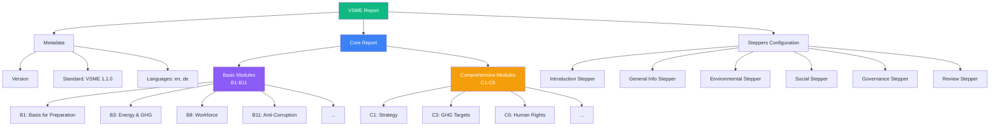
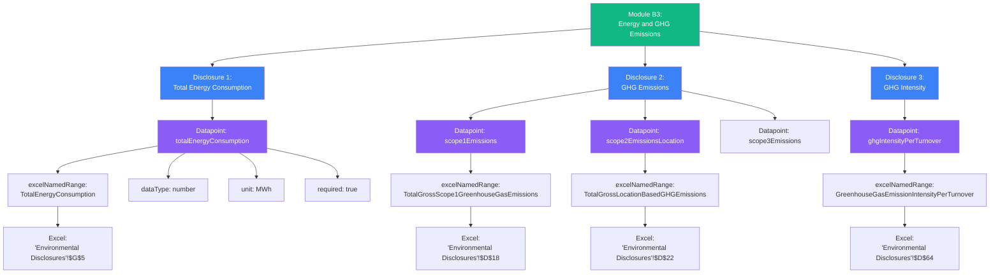
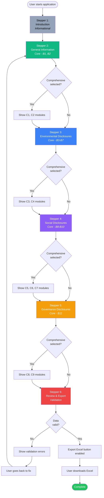
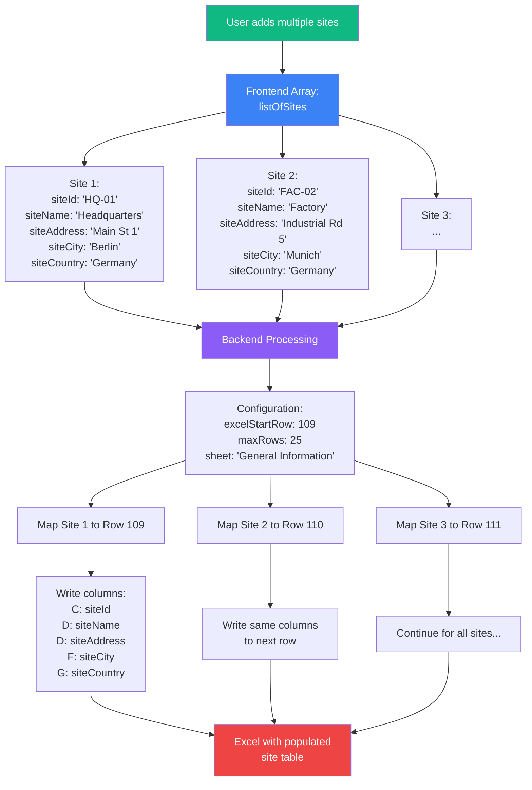

# VSME Data Model - Visual Documentation

This document provides visual representations of the VSME data model hierarchy and data flows using Mermaid diagrams.

## Table of Contents

1. [Overall Report Structure](#1-overall-report-structure)
2. [Module Detail View (B3 Example)](#2-module-detail-view-b3-example)
3. [Frontend-Backend Data Flow](#3-frontend-backend-data-flow)
4. [Named Range Mapping Process](#4-named-range-mapping-process)
5. [Stepper Navigation Flow](#5-stepper-navigation-flow)
6. [Repeating Data Structure](#6-repeating-data-structure)

---

## 1. Overall Report Structure

High-level hierarchy of the VSME report data model following EFRAG terminology.



---

## 2. Module Detail View (B3 Example)

Detailed structure of a single module showing the hierarchy: Module → Disclosure → Datapoint → Excel Named Range.



---

## 3. Frontend-Backend Data Flow

Complete data flow from user input in the frontend to Excel file generation in the backend.

```mermaid
sequenceDiagram
    participant User
    participant Frontend as React Frontend<br/>(TypeScript)
    participant Zustand as Zustand Store
    participant API as API Client
    participant Backend as Spring Boot Backend<br/>(Kotlin)
    participant ExcelService as Excel Service
    participant Template as VSME Excel Template
    
    User->>Frontend: Fills form in wizard
    Frontend->>Zustand: Updates store state
    
    User->>Frontend: Clicks "Export Excel"
    Frontend->>Zustand: Retrieves all data
    Zustand-->>Frontend: Complete report data
    
    Frontend->>Frontend: Validates data
    Frontend->>Frontend: Transforms to ExcelExportRequest
    
    Frontend->>API: POST /api/vsme/export<br/>(ExcelExportRequest)
    API->>Backend: HTTP Request
    
    Backend->>Backend: Validates request
    Backend->>Backend: Extracts datapoints
    
    Backend->>ExcelService: generateExcel(request)
    ExcelService->>Template: Load template
    Template-->>ExcelService: Workbook loaded
    
    loop For each module
        loop For each datapoint
            ExcelService->>ExcelService: Get Named Range
            ExcelService->>Template: Write value to cell
        end
    end
    
    loop For each repeating data
        ExcelService->>ExcelService: Iterate rows
        ExcelService->>Template: Write array items
    end
    
    ExcelService->>ExcelService: Save workbook to bytes
    ExcelService->>ExcelService: Encode to Base64
    ExcelService-->>Backend: Base64 Excel string
    
    Backend->>Backend: Create ExcelExportResponse
    Backend-->>API: HTTP Response (JSON)
    API-->>Frontend: ExcelExportResponse
    
    Frontend->>Frontend: Decode Base64
    Frontend->>Frontend: Create Blob
    Frontend->>User: Trigger download
    User->>User: Receives VSME-Report.xlsx
    
    style User fill:#10b981,color:#fff
    style Frontend fill:#3b82f6,color:#fff
    style Backend fill:#8b5cf6,color:#fff
    style ExcelService fill:#f59e0b,color:#fff
```

---

## 4. Named Range Mapping Process

How datapoints are mapped to Excel Named Ranges and written to specific cells.

```mermaid
graph LR
    A[User Input:<br/>entityName = 'Acme GmbH'] --> B[Frontend Data:<br/>datapointId: 'entityName'<br/>value: 'Acme GmbH']
    
    B --> C[API Request:<br/>ExcelExportRequest]
    
    C --> D[Backend Processing]
    
    D --> E[Lookup Mapping:<br/>datapointId → Named Range]
    
    E --> F[Named Range:<br/>'NameOfReportingEntity']
    
    F --> G[Resolve to Cell:<br/>'General Information'!$D$3]
    
    G --> H[Write to Excel:<br/>Sheet: General Information<br/>Cell: D3<br/>Value: 'Acme GmbH']
    
    H --> I[Excel File with<br/>populated data]
    
    style A fill:#10b981,color:#fff
    style B fill:#3b82f6,color:#fff
    style F fill:#8b5cf6,color:#fff
    style H fill:#f59e0b,color:#fff
    style I fill:#ef4444,color:#fff
```



---

## 5. Stepper Navigation Flow

User navigation through the wizard interface showing the stepper sequence.



---

## 6. Repeating Data Structure

How repeating/table data (arrays) are structured and mapped to Excel rows.



---

## EFRAG Terminology Reference

The diagrams use the official EFRAG VSME terminology:

- **Module**: Top-level reporting category (e.g., B1, B3, C1)
- **Disclosure**: Specific reporting requirement within a module (e.g., "Total Energy Consumption")
- **Datapoint**: Individual data field that collects a specific value (e.g., `entityName`, `scope1Emissions`)
- **Named Range**: Excel named cell/range that the datapoint maps to for backend processing
- **Stepper**: UI component in the wizard that groups related modules

---

## Legend


- **Green**: User-facing elements, entry points
- **Blue**: Frontend components, data structures
- **Purple**: Backend processing, business logic
- **Orange**: Excel operations, file generation
- **Red**: Final outputs, downloads
- **Gray**: Informational, read-only

